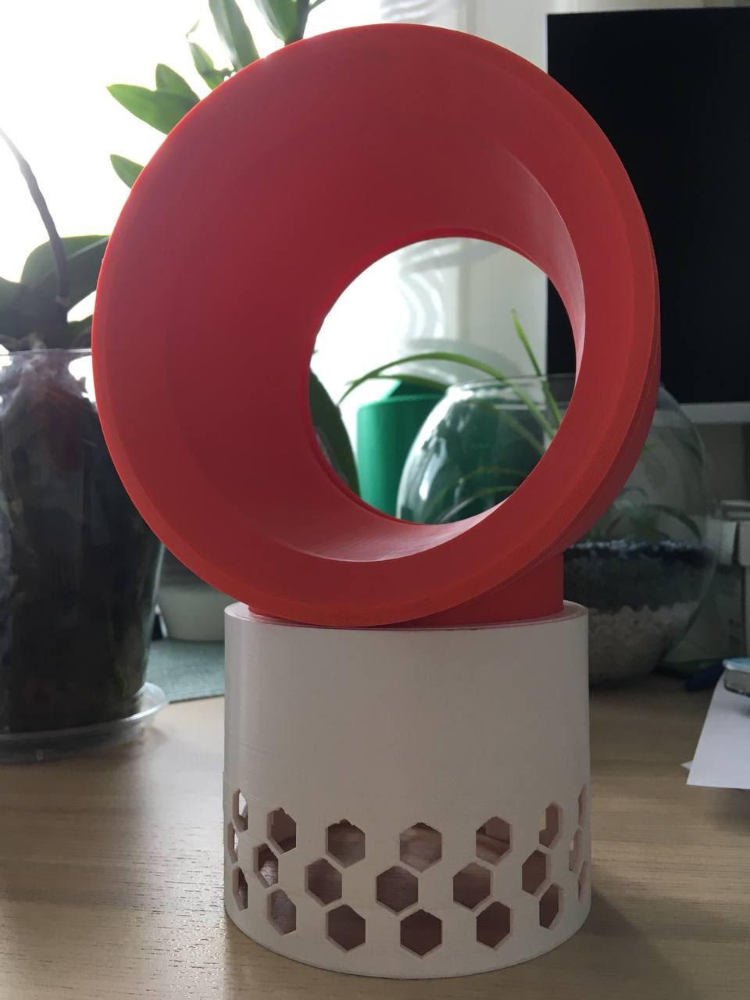
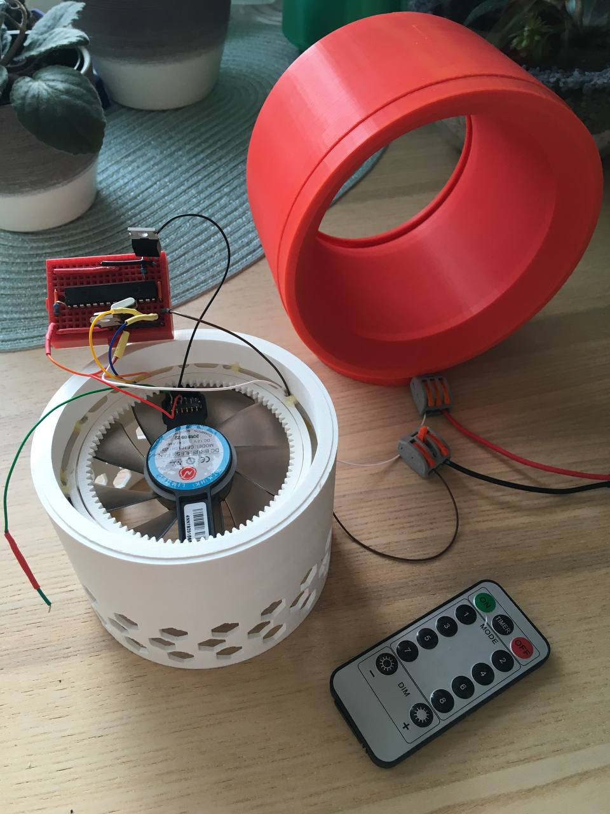

# PETPROJ21

This is a project for the Microcontroller Programming subject (2021). The project is dedicated to build one of IoT item.
The goal is to learn how to control microcontroller (particularly ATmega328P).

## Idea:

The idea is to design a middle size remote controlled [bladeless fan](https://en.wikipedia.org/wiki/Air_multiplier). 

 

## Hardware description:

* Microcontroller: [ATmega 328P](https://www.microchip.com/wwwproducts/en/ATmega328P)
* Cooler: DC Brushless fan (CF1015H12D)
* Additionals for voltage conversions: IRF520, 7805.
* Power suppliers / wires / etc.

## Acknowledgment

Credits to [IRremote Library](https://github.com/Arduino-IRremote/Arduino-IRremote) developers.
